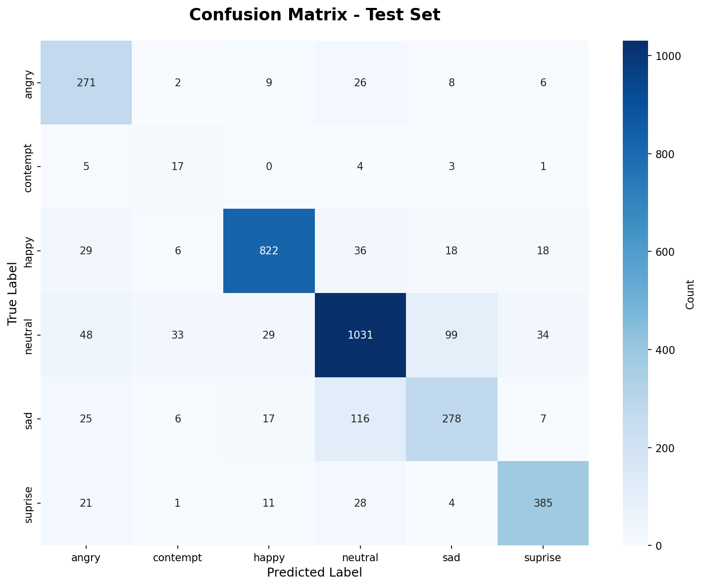
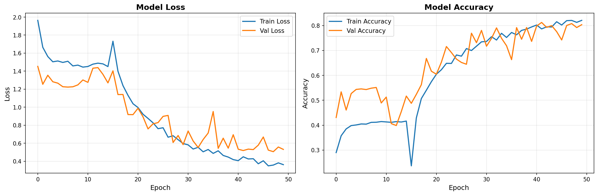

# Aplicação de detecção de emoções em tempo real

Este projeto consiste em uma aplicação web desenvolvida para detectar emoções humanas em tempo real a partir de vídeo, utilizando técnicas de processamento de imagens e aprendizado de máquina.

O dataset **FERPlus** foi utilizado e, das 8 classes originais, optamos por manter apenas 6 classes: **raiva, desprezo, felicidade, neutralidade, tristeza e surpresa**

## Tecnologias utilizadas
- HTML5
- Python 3
- TensorFlow.js
- MobileNet
- Web API


## Arquitetura

O projeto foi estruturado de forma a separar claramente as etapas de treinamento do modelo e inferência em tempo real, seguindo boas práticas de aprendizado de máquina e engenharia de software.

```
Treinamento (Python) → Exportação para TensorFlow.js → Inferência (Browser)
```


###  Camadas da Arquitetura

* **Treinamento**

  * Responsável pelo treinamento da rede neural convolucional baseada em **MobileNetV2**
  * Avaliação do modelo por meio de métricas e matriz de confusão
  * Conversão do modelo treinado para o formato compatível com TensorFlow.js

* **Inferência**

  * Captura de vídeo em tempo real via webcam
  * Classificação das emoções diretamente no navegador com TensorFlow.js

## Treinamento do Modelo

O modelo de classificação de emoções foi treinado previamente em ambiente Python, utilizando bibliotecas de aprendizado de máquina e deep learning.

### Etapas do Treinamento

1. **Aquisição do Dataset**

   * Conjunto de imagens faciais rotuladas por emoção

2. **Pré-processamento**

   * Redimensionamento das imagens
   * Normalização dos pixels
   * Conversão para escala compatível com o modelo

3. **Extração de Características**

   * Uso da arquitetura **MobileNet** como base

4. **Treinamento da Rede Neural**

   * Ajuste dos pesos para classificação das emoções

5. **Avaliação do Modelo**

   * Cálculo de métricas de desempenho

6. **Exportação para TensorFlow.js**

   * Conversão do modelo treinado para o formato `model.json` + arquivos `.bin`


## Avaliação do modelo

A matriz de confusão foi utilizada para avaliar o desempenho do modelo de classificação de emoções.



A partir da matriz, é possível observar:
* A taxa de acertos por classe
* Emoções com maior confusão entre si
* Pontos fortes e limitações do modelo

---

O gráfico abaixo apresenta a evolução da acurácia (accuracy) e da função de perda (loss) do modelo ao longo das épocas de treinamento.



A partir do gráfico, é possível observar a convergência do modelo durante o treinamento, indicando aprendizado progressivo e estabilidade nas métricas avaliadas.


## Estrutura de Pastas e Arquivos

```
facial-expressions-detector/
├── src/
│   ├── train_mobilenetv2.py     # Script de treinamento
│   ├── convert_mobilenetv2.py   # Conversão para TensorFlow.js
│   └── web/                     # Aplicação web (TensorFlow.js)
│       ├── index.html           # Página principal
│       ├── script.js            # Lógica de captura e inferência
│       ├── styles.css           # Estilos da aplicação
│       ├── EmotionDetectorFactory.js
│       ├── MobileNetDetector.js # Detector de emoções
│       ├── init-webgl.js        # Inicialização do WebGL
│       ├── webgl-diagnostic.js  # Diagnóstico do WebGL
│       ├── server.py            # Servidor HTTP local
│       ├── server_https.py      # Servidor HTTPS local
│       └── model/               # Modelo treinado
│           ├── model.json
│           ├── group1-shard*.bin
│           └── mobilenet/
│
├── models/                      # Modelo salvo (formato Keras/TF)
│
├── plots/                       # Resultados experimentais
│   ├── confusion_matrix.png
│   └── training_history.png
│
└── Readme.md                    # Documentação do projeto
```

Os scripts em `src/` documentam o processo de treinamento e avaliação do modelo, enquanto a pasta `src/web/` contém exclusivamente a aplicação final executada no navegador.


## Como executar a aplicação

A aplicação pode ser acessada via navegador clicando [aqui](https://facial-emotion-detection-e9vn.vercel.app/)


### Executar localmente

#### 1. Clonar o repositório

```bash
git clone https://github.com/dsantosr/facial-expressions-detector.git
cd facial-expressions-detector
```

#### 2. Subir um servidor local

```bash
cd src/web
python3 server.py
```

Ou, para acesso via HTTPS (necessário para câmera em dispositivos móveis):

```bash
python3 server_https.py
```

#### 3. Acessar no navegador

```
http://localhost:8000      # server.py
https://localhost:8443     # server_https.py
```


---


Ao entrar no site, **clique em "Start Camera"**, espere alguns segundos até que o modelo conclua o carregamento e **permita o acesso a câmera através de um pop-up que aparecerá no navegador**

